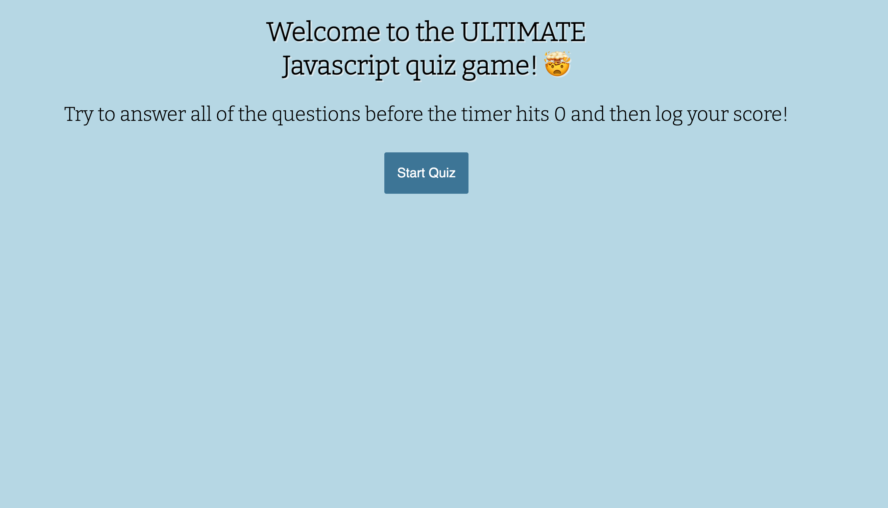
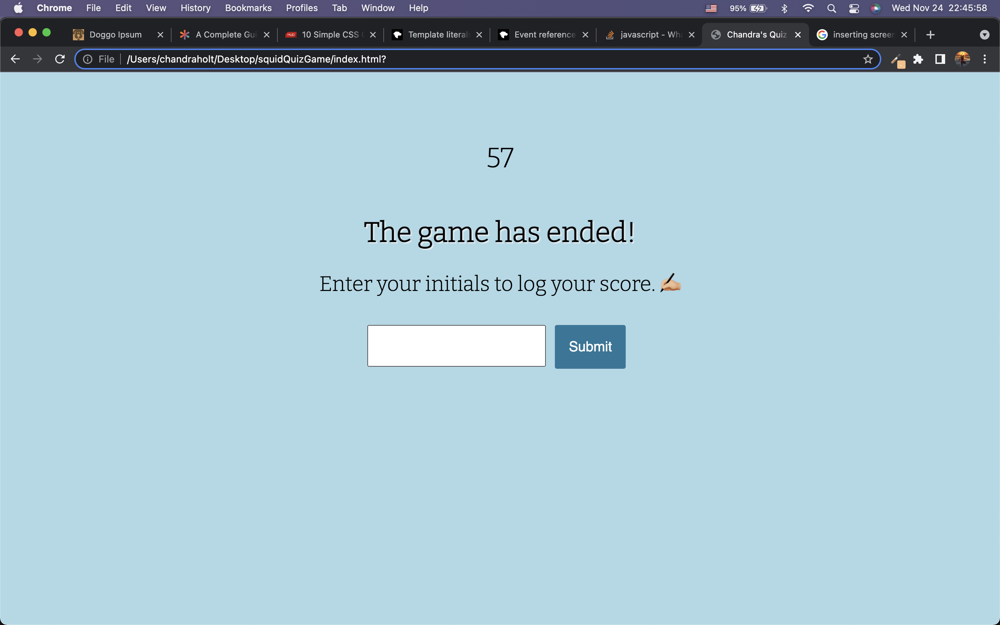
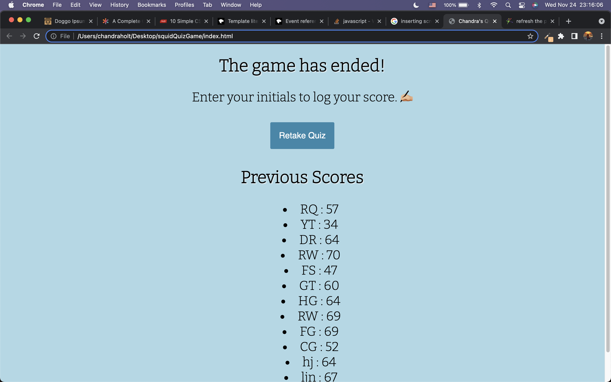
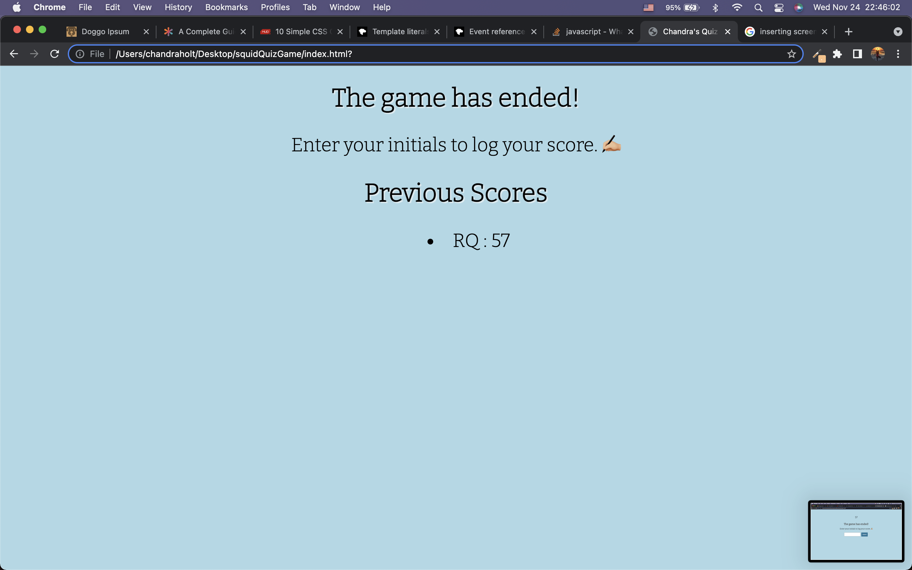

# squidQuizGame
Challenge yourself with this quiz game!

[Deployed Application](https://chandrapanda.github.io/squidQuizGame/)

Users may choose from three answers on 10 JavaScript-related trivia questions. 

A timer runs in the background to log time during the game.

Results from quiz are shown so user knows their score and can log their score with their initials.

User can view their previous high scores along with high scores of previous users. 

After user completes the game, they may choose to retake the quiz at the simple press of a button.

# Technologies Used

Native JavaScript, HTML, CSS

## Screen shots

[Screen shots showcasing the functionality of the site.](https://github.com/chandrapanda/squidQuizGame/issues/1#issue-1063231610)











## User Story

```
AS A coding boot camp student
I WANT to take a timed quiz on JavaScript fundamentals that stores high scores
SO THAT I can gauge my progress compared to my peers
```

## Acceptance Criteria

```
GIVEN I am taking a code quiz
WHEN I click the start button
THEN a timer starts and I am presented with a question
WHEN I answer a question
THEN I am presented with another question
WHEN I answer a question incorrectly
THEN time is subtracted from the clock
WHEN all questions are answered or the timer reaches 0
THEN the game is over
WHEN the game is over
THEN I can save my initials and my score
```
# License
This software is available under teh following licenses:
* MIT 

# Contact
https://github.com/chandrapanda/
